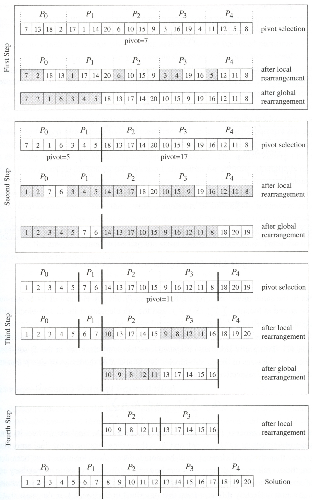
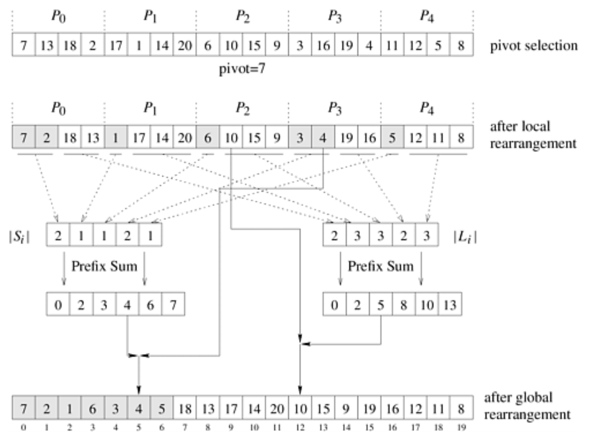
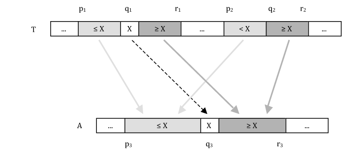
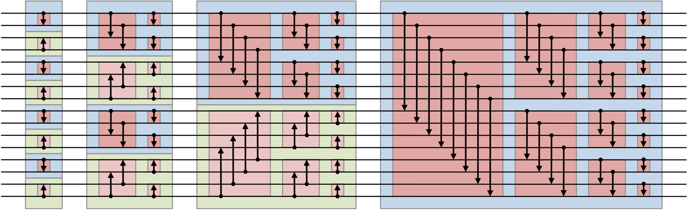

class: center, middle

# CME 213, ME 339&mdash;Spring 2021

## Eric Darve, ICME, Stanford


“Optimism is an occupational hazard of programming; feedback is the treatment.”
(Kent Beck)

---
class: middle, center

# Sorting algorithms on shared memory computers

---
class: middle, center

Homework 2 focuses on **radix sort**

---
class: middle, center

Applies to integers or floats only

Uses buckets

Partitions the bits into small groups

Order using groups of bits and buckets

---
class: center, middle

# Radix sort animations

[Musical demo MSD](https://www.youtube.com/watch?v=Tmq1UkL7xeU)

[Musical demo LSD](https://www.youtube.com/watch?v=LyRWppObda4)

Most/least significant digit

---
class: middle, center

Quicksort

One of the fastest sorting algorithms

---
class: middle

# Quicksort algorithm

Divide and conquer approach. Divide step:

- Choose a pivot $x$
- Separate sequence into 2 sub-sequences with all elements smaller than $x$ and greater than $x$

Conquer step:

- Sort the two subsequences

---
class: middle, center


---
class: middle

```
def quicksort(A,l,u):
    if l < u-1:
        x = A[l]
        s = l
        for i in range(l+1,u):
            if A[i] <= x: # Swap entries smaller than pivot
                s = s+1
                A[s], A[i] = A[i], A[s]
        A[s], A[l] = A[l], A[s]
        quicksort(A,l,s)
        quicksort(A,s+1,u)
```

[Python code](https://github.com/EricDarve/cme213-spring-2021/tree/main/Code/Lecture_05)

---
class: middle, center

On average, it runs very fast, even faster than mergesort.

It requires no additional memory

[Musical demo LL pointers](https://www.youtube.com/watch?v=9IqV6ZSjuaI)

[Musical demo LR pointers](https://www.youtube.com/watch?v=8hEyhs3OV1w)

[Musical demo Quicksort ternary](https://www.youtube.com/watch?v=q4wzJ_uw4aE)

---
class: middle, center

Some disadvantages

Worst-case running time is $O(n^2)$ when input is already sorted

Not stable

---
class: center



---
class: center



---
class: middle

# Mergesort

1. Subdivide the list into n sub-lists (each with one element).

2. Sub-lists are progressively merged to produce larger ordered sub-lists.

---
class: center


---
class: middle, center

[Musical demo](https://www.youtube.com/watch?v=ZRPoEKHXTJg)

---
class: middle, center

# Parallel mergesort

When there are many sub-lists to merge, the parallel implementation is straightforward: assign each sub-list to a thread.

When we get few but large sub-lists, the parallel merge becomes difficult.

---
class: middle, center

Merging large chunks

Subdivide the merge into several smaller merges that can be done concurrently.

---
class: middle, center



---
class: middle, center

# Bucket and sample sort

---
class: middle

# Bucket sort

Sequence of integers in the interval $[a,b]$

1. Split $[a,b]$ into $p$ sub-intervals
2. Move each element to the appropriate bucket (prefix sum)
3. Sort each bucket in parallel!

---
class: center, middle

Problem: how should we split the interval in bucket sort? 

This process may lead to intervals that are unevenly filled.

Improved version: splitter sort.

---
class: center, middle


---
class: center, middle

# Sorting networks

Building block: compare-and-exchange (COEX)

In sorting networks, the sequence of COEX is **independent** of the data

One of their advantages: very regular data access

---
class: middle, center

.compact[*A novel sorting algorithm for many-core architectures based on adaptive bitonic sort,*
H. Peters, O. Schulz-Hildebrandt, N. Luttenberger]


---
class: middle, center

# Bitonic sequence

First half &#8599;, second half &#8600;, or

First half &#8600;, second half &#8599;


---
class: middle, center

There is a fast algorithm to partially "sort" a bitonic sequence

Bitonic *compare*

---
class: middle, center

Input: bitonic sequence

# Bitonic compare

First half

$\min(E\_0,E\_{n/2}), \min(E\_1,E\_{n/2+1}), \ldots, \min(E\_{n/2-1},E\_{n-1})$

Second half

$\max(E\_0,E\_{n/2}), \max(E\_1,E\_{n/2+1}), \ldots, \max(E\_{n/2-1},E\_{n-1})$

---
class: middle, center


---
class: middle, center

Output

Two bitonic sequences

Left is smaller than right

---
class: middle

Build a bitonic sorting network to sort the entire array

Process:

1. Start from small bitonic sequences
2. Use compare and merge to get longer bitonic sequences
3. Repeat until sorted

---
class: middle, center



---
class: middle, center

Complexity

$(\log n)^2$ passes

[Musical demo](https://www.youtube.com/watch?v=r-erNO-WICo)

[Python code](https://github.com/EricDarve/cme213-spring-2021/tree/main/Code/Lecture_06)

---
class: middle

Exercise

- `bitonic_sort_lab.cpp`Open this code to start the exercise
- `bitonic_sort.cpp` Solution with OpenMP
- `bitonic_sort_seq.cpp`Reference sequential implementation
- [Code](https://github.com/EricDarve/cme213-spring-2021/tree/main/Code/Lecture_06)

---
class: center, middle

`-DNDEBUG` no-debug option

`true` by default

Remove `-DNDEBUG` from `Makefile` to print additional information

---
class: center, middle

Outer `i` loop cannot be parallelized

Step 1: parallelize `j` loop

`for (int j = 0; j < n; j += i)`

Call `BitonicSortSeq(...)` inside `j` loop

---
class: middle

Step 2: split `i` loop into small chunks and large chunks

`for (int i = 2; i <= chunk; i <<= 1){}`

`for (int i = chunk << 1; i <= n; i <<= 1){}`

---
class: middle, center


---
class: middle

Step 3: large-chunk `i` loop

`for (int i = chunk << 1; i <= n; i <<= 1)`

Call `BitonicSortPar(j, i, seq, up, chunk)`

---
class: middle

`BitonicSortPar()`

`split_length` is very large

Step 4: parallelize `i` loop in `BitonicSortPar()`

`for (int i = start; i < start + split_length; i++)`

---
class: middle

Ultimately fails when `split_length` becomes small again

Step 5: recursively call `BitonicSortPar` only if `split_length > chunk`

Add 

`if (split_length > chunk){}` 

around the two recursive calls to `BitonicSortPar()`

---
class: middle, center


---
class: middle

Code is now wrong; one more pass is needed!

Go back to the `i` loop 

`for (int i = chunk << 1; i <= n; i <<= 1){}`

in `main()`

---
class: middle

Step 6: add

```
#pragma omp parallel for
for (int j = 0; j < n; j += chunk)
{
    bool up = ((j / i) % 2 == 0);
    BitonicSortSeq(j, chunk, seq, up);
}
```

at the end of the `i` loop block

`for (int i = chunk << 1; i <= n; i <<= 1){}`

---
class: middle

The exercise is complete.

Your code should now produce the correct result!

The running time should decrease as you increase the number of threads.

Run using

```
export OMP_NUM_THREADS=4; ./bitonic_sort
```

---
class: middle

```
darve@omp:~$ export OMP_NUM_THREADS=1; ./bitonic_sort
Size of array: 8388608
Size of chunks: 8388608
Number of chunks: 1
Number of threads: 1
Elapsed time = 3.24 sec, p T_p = 3.24.
darve@omp:~$ export OMP_NUM_THREADS=4; ./bitonic_sort
Size of array: 8388608
Size of chunks: 2097152
Number of chunks: 4
Number of threads: 4
Elapsed time = 0.83 sec, p T_p = 3.33.
```
