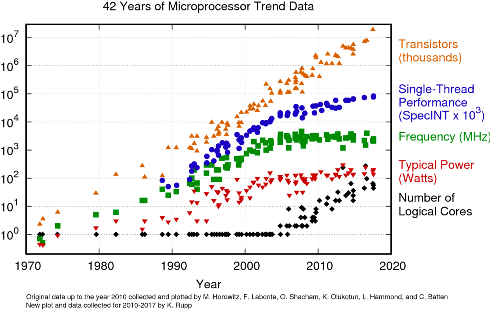
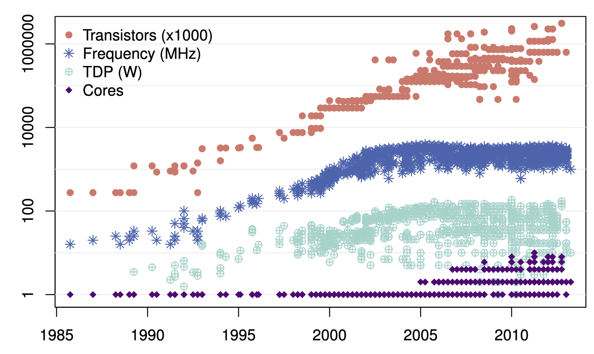
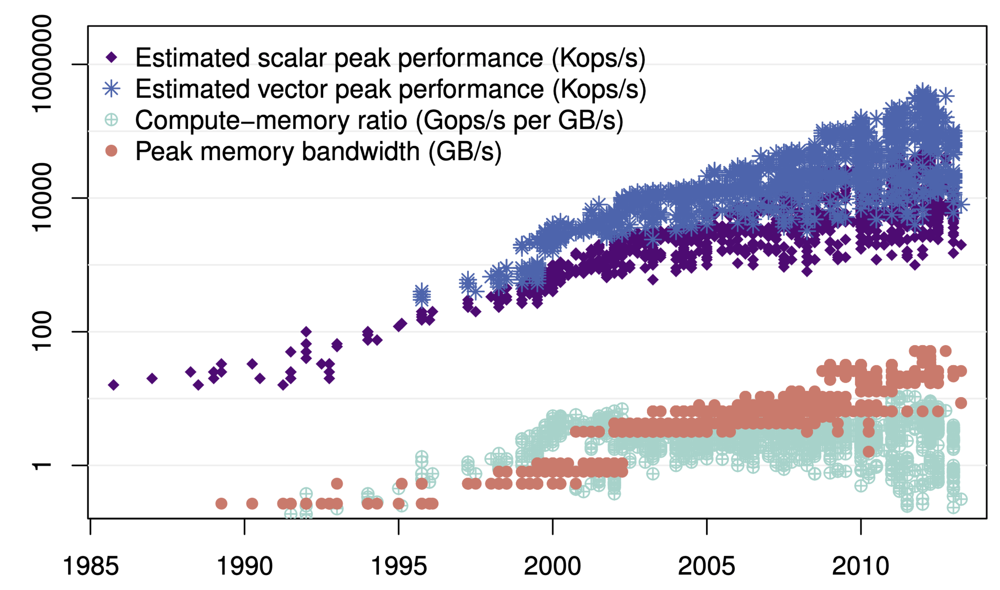
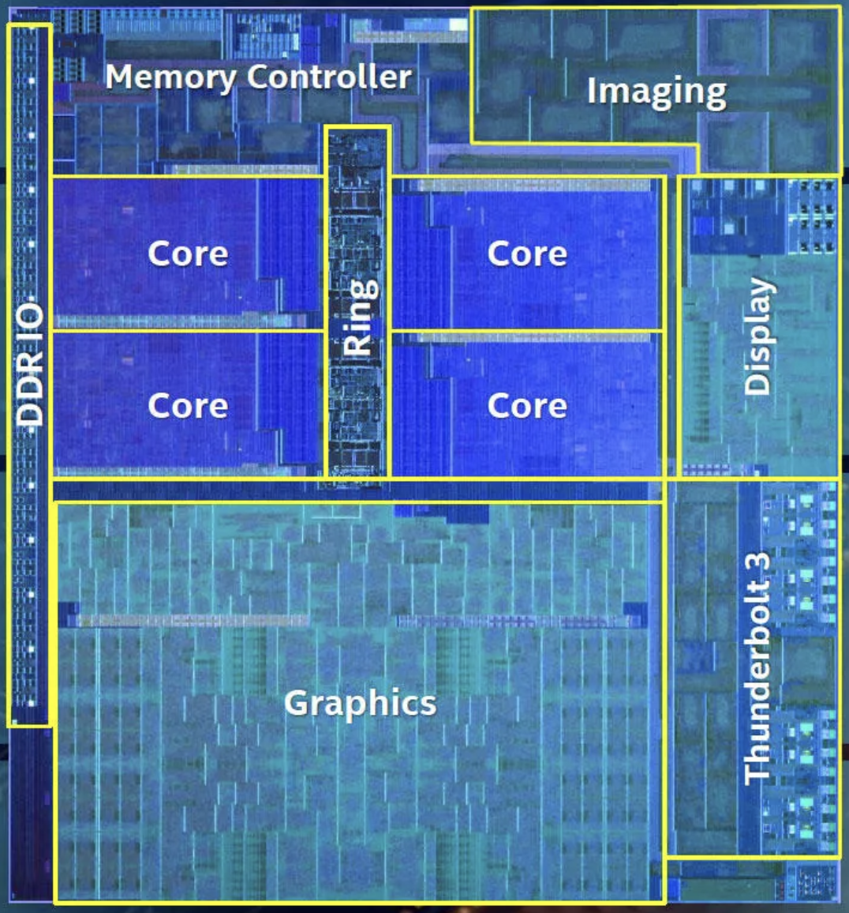
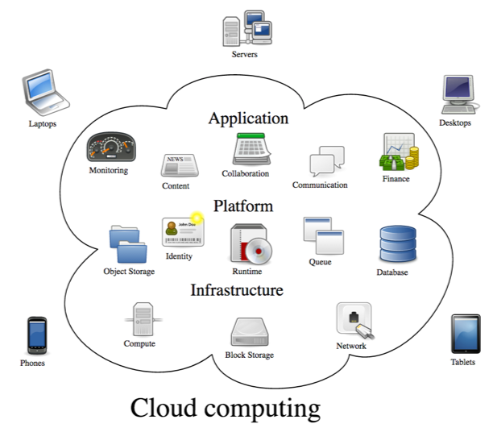
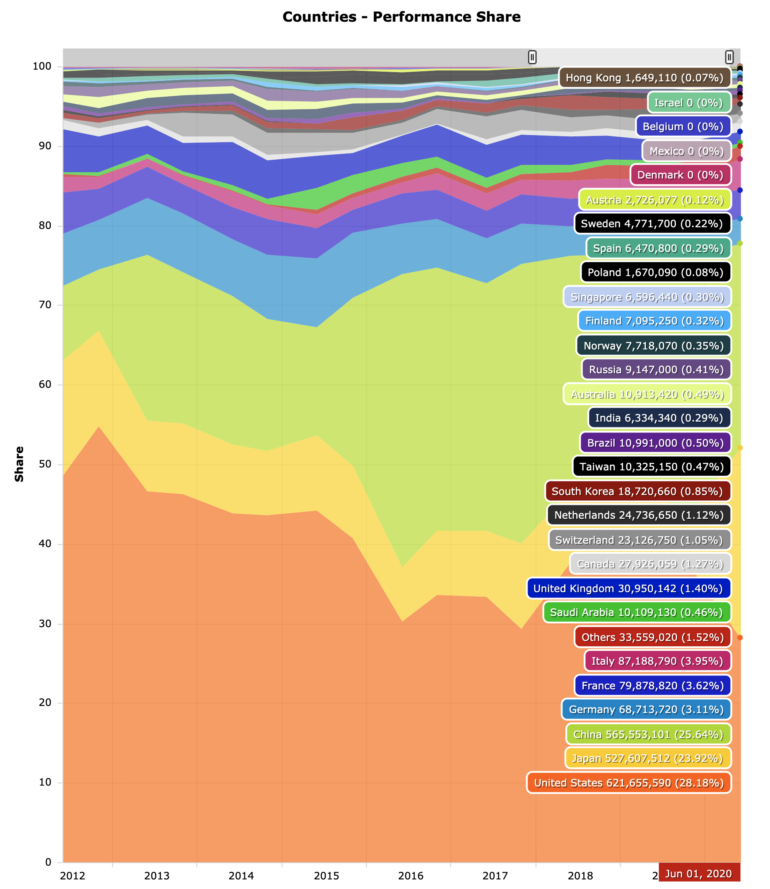
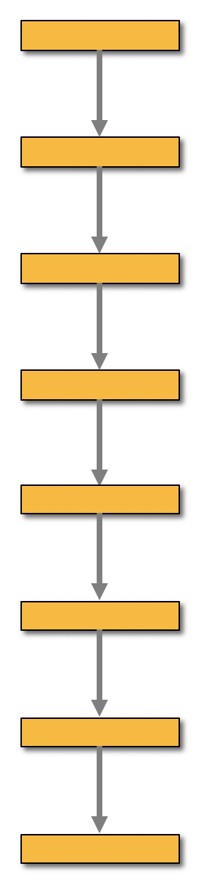
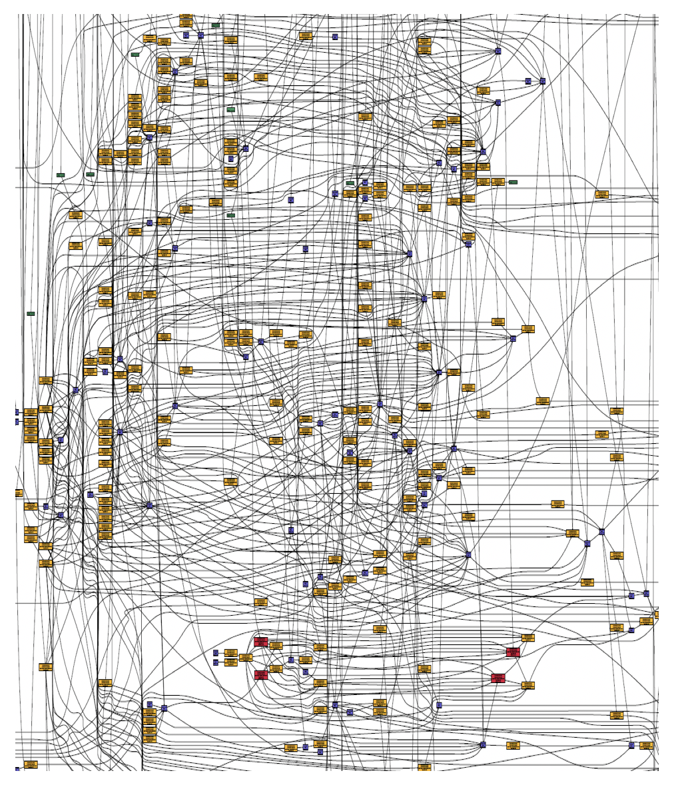
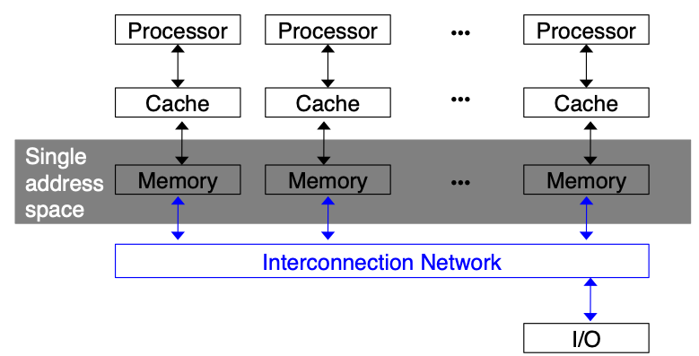
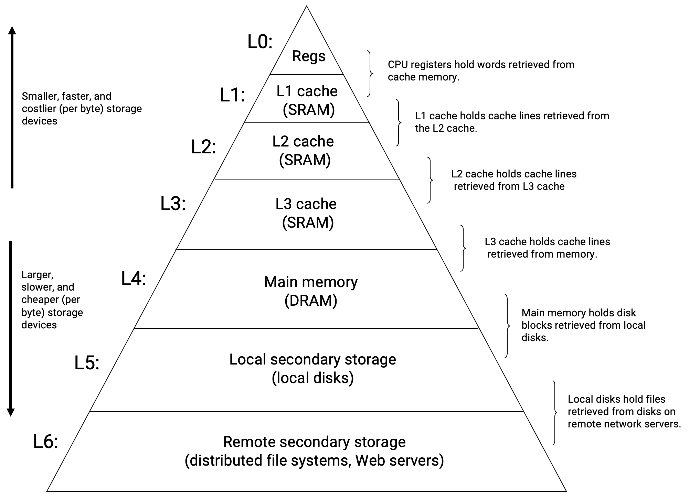

class: center, middle

# CME 213, ME 339&mdash;Spring 2021<br/>Introduction to parallel computing using MPI, openMP, and CUDA

## Eric Darve, ICME, Stanford


"Computers are useless.  They can only give you answers."
(Pablo Picasso)

---
class: middle

# Homework 1

Pre-requisite homework

Topics: 

- derived classes
- polymorphism
- standard library
- testing

---
class: middle

# Submission

1. Submit your PDF on gradescope
1. For your computer code, copy your files to `cardinal`
1. Run a Python script it submit code

Grading is done on gradescope

.center[]

---
class: center, middle

Deadline is **Friday, April 9**

---
class: center, middle

# Why parallel computing?


---
class: center, middle

Parallel computing is omni-present

Any type of non-trivial computing requires parallel computing

---

.pull-left[]
.pull-right[- Gordon Moore 1965: "the number of transistors on a chip shall double every 18&ndash;24 months."
- Accompanied by an increase in clock speed
]

---
class: center, middle

# Intel microprocessor trends



---

# But

Increase in transistor density is limited by:
- Leakage current increases
- Power consumption increases
- Heat generated increases

---
class: center, middle

Memory access time has not been reduced at a rate comparable to the processing speed

&#8595;

Go parallel!

Multiple cores on a processor

---
class: center, middle

# Multicore

.pull-left[]
.pull-right[One/few 

but 

fast core(s)
]

---
class: center, middle

# Manycore

.pull-left[]
.pull-right[ .left[- Many, but slower cores
- GPUs]
]

---
class: center, middle

# Core increase; frequency plateau

.pull-left[
Historical data on 1403 Intel microprocessors]

.pull-right[
Historical data on 566 NVIDIA GPUs]

---
class: center, middle

# Memory wall; bandwidth and latency

.pull-left[
Intel microprocessors]

.pull-right[
NVIDIA GPUs]

---
class: center, middle

More info at

.smaller[https://pure.tue.nl/ws/portalfiles/portal/3942529/771987.pdf]

---
class: center, middle

# Parallel computing everywhere!

.pull-left[]
.pull-right[]

---
class: center, middle

# Multi and many core processors

.pull-left[

Intel Ice Lake 10 nm]
.pull-right[
NVIDIA Turing TU102 architecture]

<!-- https://en.wikipedia.org/wiki/List_of_Nvidia_graphics_processing_units -->

---
class: center, middle


---
class: middle

.pull-left[]
.pull-right[<br/><br/>]

---
class: center, middle

### [Summit](https://www.olcf.ornl.gov/olcf-resources/compute-systems/summit/)&mdash;Oak Ridge National Laboratory's 200 petaflop supercomputer


---
class: center, middle

# Top 500 Supercomputers

---
class: center, middle


---
class: center, middle

.left-column[
## Green 500
]
.right-column[]

---
class: center, middle

.left-column[
## Vendor shares
]
.right-column[]

---
class: center, middle



---
class: center, middle

More at

https://www.top500.org/

---
class: center, middle

# Example of a Parallel Computation

---
class: center, middle

# Parallel programs often look very different from sequential programs


---
class: center, middle

.pull-left[<br/>Sequential]

.pull-right[<br/>Parallel]

---
class: middle

### Example: program to sum numbers

```
for (int i = 0; i < n; ++i)
{
    x = ComputeNextValue();
    sum += x;
}
```

---
class: center, middle

We have $p$ cores that can compute and exchange data

---
class: center, middle

Can we accelerate our calculation by splitting the work among the cores?

---
class: middle

<!-- Add schematic with splitting of vector input into chunks  -->

```
int r; /* thread number */
int b; /* number of entries processed */
int my_first_i = r * b;
int my_last_i = (r + 1) * b;
for (int my_i = my_first_i; my_i < my_last_i; my_i++) {
    my_x = ComputeNextValue();
    my_sum += my_x;
}
```

---
class: center, middle

Not that simple

Each core has computed a partial sum

All these partial sums need to summed up together

---
class: center, middle

Simplest approach: 

have one "master" thread do all the work

---
class: middle

```
if (r == 0) /* master thread */
{
    int sum = my_sum;
    for (int ro = 1; ro < p; ++ro)
    {
        int sum_ro;
        ReceiveFrom(&sum_ro, ro);
        sum += sum_ro;
    }
}
else /* worker thread */
{
    SendTo(&my_sum, 0);
}
```

---
class: center, middle

That may not be enough

If we have many cores, this final sum may take a lot of time


---
class: center, middle


---
class: center, middle

This simple example illustrates the fact that it is difficult for a compiler to parallelize a program.

Instead the programmer must often re-write his code having in mind that multiple cores will be computing in parallel.

---
class: center, middle

The purpose of this class is to teach you the most common parallel languages used in science and engineering.

---
class: center, middle

# Shared Memory Processor

---
class: middle

# Schematic

- A number of processors or cores
- A shared physical memory (global memory)
- An interconnection network to connect the processors with the memory

---
class: center, middle


---
class: center, middle

# Shared memory NUMA

In many cases, the program views the memory as a single addressable space.

In reality, the memory is physically distributed.

---
class: center, middle

NUMA .red[non-uniform memory access]

Why? Faster access to memory

But, special hardware required to move data between memory banks

---
class: center, middle



---
class: center, middle

# Bulldozer server (AMD)

<br/>
.small[Cache coherent NUMA (ccNUMA) uses inter-processor communication between cache controllers to keep a consistent memory image when more than one cache stores the same memory location]

<!-- hwloc's lstopo tool -->
<!-- https://en.wikipedia.org/wiki/Non-uniform_memory_access -->

---
class: center, middle

# Motherboard with 2 CPU sockets


---
class: middle

# Performance tip on multicore

- Memory is key to developing high-performance multicore applications
- Memory traffic and time to access memory are often more important than flops
- Memory is hierarchical and complex

.center[]

---
class: center, middle



---
class: center, middle


