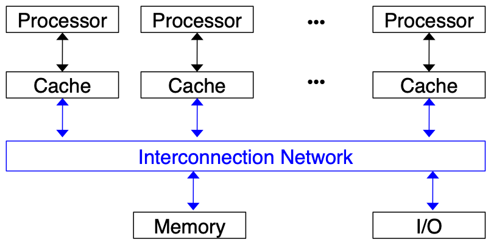
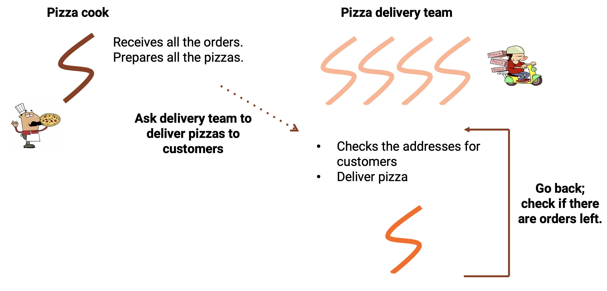

class: center, middle

# CME 213, ME 339&mdash;Spring 2021

## Eric Darve, ICME, Stanford


"Computers are getting smarter all the time.  Scientists tell us that soon they will be able to talk to us.</br>(And by 'they', I mean 'computers'.  I doubt scientists will ever be able to talk to us.)"</br>
(Dave Barry)

---
class: center, middle

# Shared Memory Processor

---
class: middle

# Schematic

- A number of processors or cores
- A shared physical memory (global memory)
- An interconnection network to connect the processors with the memory

---
class: center, middle



---
class: center, middle

# Process

Process: program in execution

Comprises: the executable program along with all information that is necessary for the execution of the program.

---
class: center, middle

# Thread

Thread: an extension of the process model. 

Can be viewed as a "lightweight" process.

A thread may be described as a "procedure" that runs independently from the main program.

---
class: center, middle

In this model, each process may consist of multiple independent control flows that are called **threads**

---
class: center, middle

Imagine a program that contains a number of procedures. 

Then imagine these procedures being able to be scheduled to run
**simultaneously and/or independently** by the operating system. 

This describes a **multi-threaded program.**

---
class: center, middle

# Shared address space

All the threads of one process share the address space of the process, i.e., they have a common address space.

When a thread stores a value in the shared address space, another thread of the same process can access this value.


---
class: center, middle


---
class: center, middle

# Threads

---
class: middle

# Threads are everywhere

- .red[C++ threads (11):] `std::thread`
- C threads: `Pthreads`
- Java threads: `Thread thread = new Thread();`
- Python threads:</br>`t = threading.Thread(target=worker)`
- Cilk: `x = spawn fib (n-1);`
- Julia: `r = remotecall(rand, 2, 2, 2)`
- .red[OpenMP]

---
class: center, middle

# C++ threads exercise

Open the file `cpp_thread.cpp`

Type `make` to compile

---
class: center, middle

`thread` constructor

```
thread t2(f2, m);

```

Creates a thread that will run function `f2` with argument `m`

---
class: center, middle

# Reference argument

```
thread t3(f3, ref(k));
```

If a reference argument needs to be passed to the thread function, it has to be wrapped with `std::ref`.

---
class: center, middle

`thread` join

```
t1.join();
t2.join();
t3.join();
```

Calling thread waits (blocks) for `t1` to complete</br>(i.e., finishes running `f1`)

Required before results of `t1` calculations become "usable"

---
class: center, middle

Complete exercise with `t4` and `f4`

---
class: middle

```
void f4() { /* todo */ }

int main(void)
{
    thread t4(); // todo
    // call f4() using thread t4; add m and k */
}
```

---
class: middle

# How can we "return" values from asynchronous functions?

Difficulty: these functions can run at any time

1. How do we allocate resources to store return value?
2. How do we query the return value?

---
class: center, middle

Answer
 
Use `promise` and `future`

---
class: center, middle

`promise`

Holds value to be returned

---
class: center, middle

`future`

Allows to query the value

---
class: center, middle

# promise/future exercise

Open `cpp_thread.cpp`

---
class: middle

`accumulate()`

```
void accumulate(vector<int>::iterator first,
                vector<int>::iterator last,
                promise<int> accumulate_promise)
{
    int sum = 0;
    auto it = first;
    for (; it != last; ++it)
        sum += *it;
    accumulate_promise.set_value(sum); // Notify future
}
```

---
class: middle

`main()`
```
promise<int> accumulate_promise; // Will store the int
future<int> accumulate_future = accumulate_promise.get_future();
thread t5(accumulate, vec_1.begin(), vec_1.end(),
          move(accumulate_promise));
// move() will "move" the resources allocated for accumulate_promise

// future::get() waits until the future has a valid result and retrieves it
cout << "result of accumulate_future [21 expected] = " 
     << accumulate_future.get() << '\n';
```

---
class: center, middle

# promise/future exercise

Complete 2nd part of `cpp_thread.cpp`

`max_promise` and `get_max()`

---
class: center, middle

What is the point of `promise` and `future`?

Why not use a reference and set the value?

---
class: center, middle

The function associated with a thread can run at any time.

So to make sure a variable has been updated,

we need to use `my_thread.join()`

---
class: center, middle

`promise`/`future` is a more flexible mechanism

As soon as `set_value` is called on the `promise`,

the value can be acquired using the `future`

---
class: center, middle

`promise`/`future` allow flexible and efficient communication between threads


---
class: center, middle

See for more information

https://en.cppreference.com/w/cpp/thread/thread

---
class: center, middle

# Thread coordination


---
class: center, middle

# The risks of multi-threaded programming


---
class: center, middle

A well-known bank company has asked you to implement a multi-threaded code to perform bank transactions

Goal: allow deposits

---
class: middle

1. Clients deposit money and the amount gets credited to their accounts.
2. But, a result of having multiple threads running concurrently the following can happen:

.center[]

---
class: center, middle

Thread 0 | Thread 1 | Balance
--- | --- | ---
Client requests a deposit | Client requests a deposit | $1000
Check current balance = $1000 | |
| Check current balance = $1000 |
Ask for deposit amount = $100 | Ask for deposit amount = $300 |
| Compute new balance = $1300 |
Compute new balance = $1100 | Write new balance to account | $1300
Write new balance to account | | $1100

---
class: center, middle

This is called a race condition

The final result depends on the precise order in which the instructions are executed


---
class: center, middle

# Race condition

Occurs when you have a sequence like

`READ/WRITE`

or

`WRITE/READ`

performed by different threads

---
class: center, middle

# Threads race to fill-up a todo-list


---
class: center, middle

Thread 0 | Thread 1
--- | ---
Thread 0 wants to add new to-do item. |
Thread 0 closes lock. Add entry in list. |
| Thread 1 wants to use the lock. It has to wait.
Thread 0 is done with the to-do list. It opens the lock. |
| Thread 1 can close the lock and add entry in list.

---
class: middle

# Mutex

A mutex can only be in two states: locked or unlocked.

Once a thread locks a mutex:
- Other threads attempting to lock the same mutex are blocked.
- Only the thread that initially locked the mutex has the ability to unlock it.

---
class: center, middle

This allows to protect regions of code.


Only one thread at a time can execute that code.

---



---
class: center, middle

Open `mutex_demo.cpp`

---
class: middle

```
void PizzaDeliveryPronto(int thread_id)
{
    g_mutex.lock();
    while (!g_task_queue.empty())
    {
        printf("Thread %d: %s\n", thread_id, g_task_queue.front().c_str());
        g_task_queue.pop();
        g_mutex.unlock();

        Delivery();
        g_mutex.lock();
    }
    g_mutex.unlock();
    return;
}
```